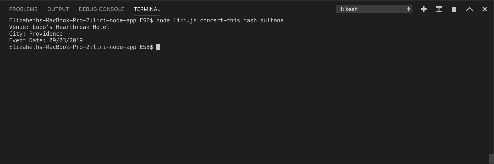
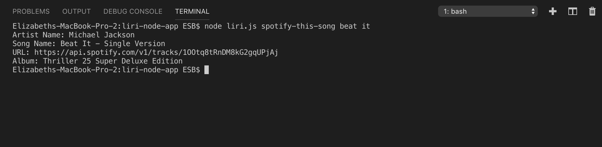
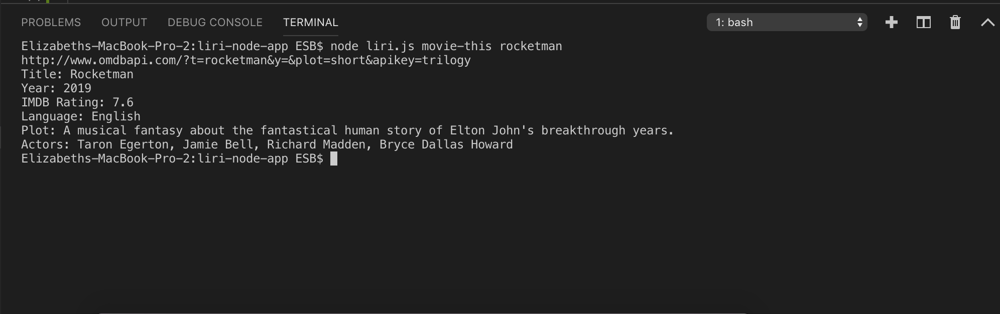
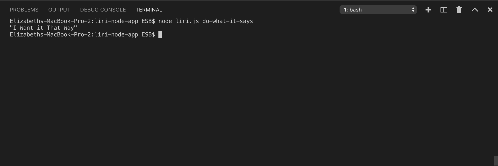

# liri-node-app

<h2> LIRI is like iPhone's SIRI. However, while SIRI is a Speech Interpretation and Recognition Interface, LIRI is a Language Interpretation and Recognition Interface. LIRI will be a command line node app that takes in parameters and gives you back data. </h2>

<!-- Clearly state the problem the app is trying to solve (i.e. what is it doing and why)
Give a high-level overview of how the app is organized
Give start-to-finish instructions on how to run the app
Include screenshots, gifs or videos of the app functioning
Contain a link to a deployed version of the app
Clearly list the technologies used in the app
State your role in the app development -->

 The problem that the app is trying to solve is to take in certain user arguments, and once the user specifies
which argument they would like to interpret, the solution of information will be delivered. To dive into this deeper, when the user specifies a certain perameter, different APIs are targeted in order to give the user the information they have searched. For example, when a user would like to find the information about a certain song, they can specify within the terminal search 'spotify-this-song' plus a song title. The information returned will deliver the artist's name, song name, url to the song in Spotify, and the album the song was in. This relates to the other searches specified, ie. 'concert-this', 'movie-this', and 'do-what-it-says.' 

 The technologies used within this app includes OMDB, Bands In Town, and Node-Spotify APIs. As well as the APIs utilized, Axios has to be installed within the application as well as Moment, DotEnv. These allow certain information to be delivered through the application. 

 Concert This Screenshot 

 Spotify This Song Screenshot 

 Movie This Screenshot 

 Do What It Says Screenshot 

